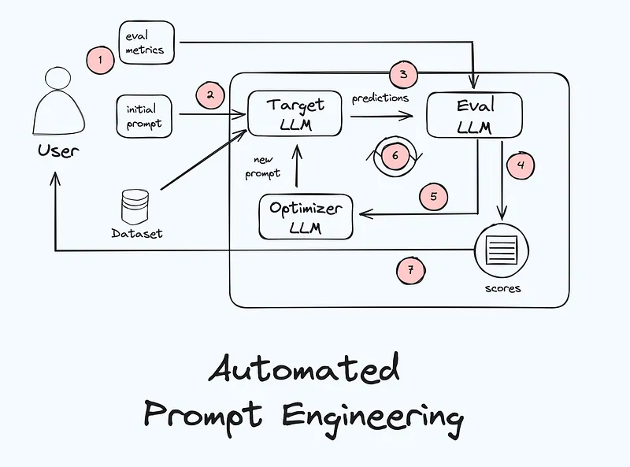

# ape
APE 的工作流程如下图所示：

要开始使用 APE，我们需要提供以下素材：(1) 一个有标注数据集，代表需要创建提示词的任务；(2) 一个初始提示词；(3) 一个评估指标。

从初始提示词开始：启动 APE 工作流程，将初始提示词和数据集发送给目标 LLM，即我们想要在生产中使用的 LLM，并且我们想要为其创建经过优化的提示词。

生成响应：LLM 将根据数据集和初始提示词生成响应。举个例子，如果我们有 10 条推文，初始提示词是「识别此推文中的情绪」，则目标 LLM 将创建 10 个响应 —— 每条推文一个情绪分类。

评估响应：因为数据集已有标注，所以我们已有每条推文的 ground truth。现在，评估器 LLM 将 ground truth 与目标 LLM 的输出进行比较，并确定目标 LLM 的性能并存储结果。

优化提示词：现在优化器 LLM 将提出一个新的提示词。

重复 3-5 步：生成响应、评估响应和优化提示词的过程会重复迭代。每次迭代，提示词都会得到改进，从而让 LLM 输出越来越好的响应。

选择最佳提示词：经过一定次数的迭代或达到令人满意的性能水平后，可以停止该工作流程了。此时，性能最佳的提示词（以及所有提示词的分数）将发送回用户。
